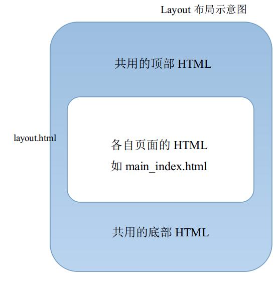
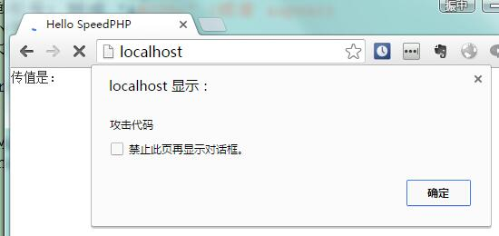
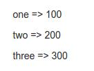
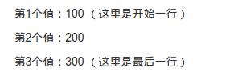
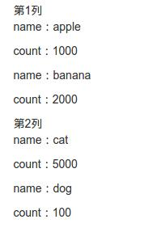

##新版模板引擎特性和使用方法

新版的sp框架，已经集成了一个非常轻量级的模板引擎，通过120行左右的代码，实现兼容Smarty开发中最常用的语法，是代替Smarty的首选。

> 绝大部分开发过程中，我们用到Smarty引擎的功能只是Smarty的百分之一代码量不到，并且Smarty越来越臃肿。所以我们开发了新的模板引擎，并且内置在框架内，仅仅120行的代码，实现了日常开发全部用到的模板功能。

###特性

**编译**

- 模板在第一次框架执行时，会被编译成php文件并保存下来，之后除非模板文件有修改，否则会一直使用编译后的php文件，极大节省了资源。
- 模板编译成php文件更方便opcode缓存，性能非常好。
- 当模板的其中一部分被修改后，会触发局部编译，仅仅针对部分页面进行编译，也很好地节省了资源。

**目录**

- 编译目录在protected/tmp，模板目录在protected/view。protected/view也称为模板根目录。
- 目录均为默认配置，只有在SAE环境下需要配置'view'  => array('compile_dir'=>SAE_TMP_PATH),具体参考本手册。

**自带防跨站脚本攻击XSS**

- 每个输出到页面的模板变量，默认都会被进行htmlspecialchars()的转换，以保证输入脚本不会被执行。
- 只有在单个变量后面加入nofilter属性后才会被取消转换原样输出，但这时候就需要开发者谨慎使用了。

> php自带的htmlspecialchars()函数会将'&'，'"'，"'"，'<'，'>'转换成对应的HTML标记。

###使用模板

**赋值**

在控制器内，可以简单地使用$this->foo=bar的方法将变量值传给模板使用。

如 $this->foo = "bar"; 那么模板内就可以使用<{$foo}>变量了。

**显示模板**

控制器内通过$this->display("模板文件名")的方式进行模板的显示。

如 模板是 protected/view/guestbook.html 文件，要在控制器显示即可用以下代码：

    $this->display("guestbook.html");
    
就可以显示出来。

> 这里protected/view也称为模板根目录。

如果是模板目录内还有子目录，即可在display里面带上子目录。

如 模板是 protected/view/main/index.html 文件，那么：

    $this->display("main/index.html");
    
> display()使用的路径均以模板根目录为开始。

**自动显示模板**

sp框架的模板自动输出可以让我们不需要使用display语句就可以将模板输出， 对代码本身而言是简化了不少，对开发者而言也更方便了。

> 旧版框架广受好评的自动模板输出，新版也继承了，而且是内置的，不需要配置。

在模板根目录里面，把模板名称设置为“控制器名_方法名.html”，对应控制器/方法就不需要display()，而直接输出此模板。

如模板目录内有名为：“main_index.html”的模板，那么MainController/actionIndex()里面，不需要调用$this->display()方法，也会自动输出“main_index.html”的模板。

- 模板名必须是“控制器_方法名.html”。无需配置，框架会自动检测有无匹配名称的模板，进行显示。
- 如果控制器方法内已经调用过$this->display()来显示模板，那么即使存在对应名称的模板，也不会自动显示。
- 该功能也同时支持modules模块开发，但需要多一级路径，如admin模块下的MainController/actionIndex()，那么对应的自动显示的模板文件路径是：protected/view/admin/main_index.html。注意这里多了admin一级目录。

[例子下载](images/8.zip)

**自动显示模板的最佳实践**是：在比较简单甚至没有内容只是显示模板的页面上，可以尽量多地使用自动模板（如关于网站、介绍我们等页面）。如果是模板赋值较多，逻辑较复杂的页面，建议是尽量使用$this->diplay()进行显示，这样逻辑更清晰。

**layout布局**

layout布局也是比较方便于使用模板的辅助功能，主要是解决页面之间共同的大结构的模板问题。

> 旧版框架里面，一般解决页面共用结构，是通过在各模板上面，前面include一个header.html，后面再include一个footer.html来实现的。

> 不过这样首先体验很糟糕，毕竟每个页面都需要写上下两个include，忘记了就麻烦。而且要在不同的模板动态调整大结构也是比较麻烦的，比如说使用不同的header.html。

> 当然，通过一些小技巧，旧版框架还是能实现这个layout布局的。

新版自带layout布局的模式，就可以很好解决此问题。

layout布局，可以通过一个可灵活变动的布局模板，然后自动成为其他模板的大结构。

- 布局模板可以在控制器内定义，生效访问根据控制器本身的范围，比如说MainController那么只有Main控制器里面的方法才会生效，如果是BaseController那么但凡继承BaseController都会生效（除非单独的控制器自己再覆盖定义一个）。
- 生效范围内的模板，都不再需要写外面的结构，可以直接写里面的结构。
- 模板输出的时候，布局模板会在外面，嵌套了里面的各个模板。
- **当$layout被设置成空的时候，那么当前页面就不会启用布局模板。**对于一些比较特殊的页面，如Ajax请求带模板的页面，比较方便哦。

[例子下载](images/8.zip)（和上面的自动显示模板的例子是同一个）

使用layout布局我们先要准备两个事情：

1. 要赋值给控制器的$layout这个成员变量，值是一个模板的文件名。如例子里面是在BaseController.php里面，$layout="layout.html"。
2. 在模板目录，我们要创建刚才赋值的文件名的文件。例子里面我们创建了protected/view/layout.html。

我们看看layout.html里面内容是什么：

    <!DOCTYPE html>
    <html lang="zh-CN">
    <head>
        <meta charset="utf-8">
        <meta http-equiv="X-UA-Compatible" content="IE=edge">
        <meta name="viewport" content="width=device-width, initial-scale=1">
        <title>layout演示</title>
        <link href="/i/css/bootstrap.min.css" rel="stylesheet">
    </head>
    <body>
         
        

            <nav class="navbar navbar-default">
                

                    

                        <a class="navbar-brand" href="#">
                            Layout演示
                        </a>
                    

                

            </nav>
            <{include file=$__template_file}>
        

    </body>
    </html>
    
主要关注 <{include file=$__template_file}>这句，这是布局模板的关键所在。

然后我们看看其他的模板：

main_index.html

    

        <h1>Hello, world!</h1>
        
This is a simple hero unit, a simple jumbotron-style component for calling extra attention to featured content or information.

        
<a class="btn btn-primary btn-lg" href="<{url c="view" a="index"}>" role="button">Learn more</a>

    

可以发现main_index.html和view_index.html都只有中间的HTML，没有包括头尾的HTML。（也没有header.html和footer.html什么的）

在页面输出的时候，我们查看源码，如http://localhost/main/index

    <!DOCTYPE html>
    <html lang="zh-CN">
    <head>
        <meta charset="utf-8">
        <meta http-equiv="X-UA-Compatible" content="IE=edge">
        <meta name="viewport" content="width=device-width, initial-scale=1">
        <title>layout演示</title>
        <link href="/i/css/bootstrap.min.css" rel="stylesheet">
    </head>
    <body>
         
        

            <nav class="navbar navbar-default">
                

                    

                        <a class="navbar-brand" href="#">
                            Layout演示
                        </a>
                    

                

            </nav>
            

        <h1>Hello, world!</h1>
        
This is a simple hero unit, a simple jumbotron-style component for calling extra attention to featured content or information.

        
<a class="btn btn-primary btn-lg" href="http://localhost/view/index" role="button">Learn more</a>

    
    
    

    </body>
    </html>
    
可以发现layout.html的内容已经在页面上，而且main_index.html的内容是嵌在中间的。

> 例子里面需要注意一下的是BaseController.php文件的$layout变量。

###模板语法

本章介绍新版模板引擎的全部功能，我们会发现新版模板引擎的语法和Smarty比较像，而且包含了日常开发中用到的Smarty的功能。

**限定符**

模板引擎的限定符是<{和}>，而且一般不能进行修改，除非直接使用View类。

限定符的意思是在模板页面里面，在<{ 和 }> 中间的代码，均被视为模板语法，会被模板引擎进行编译。

> 也可以把限定符内的内容理解成类似php的语法代码，在最终显示的页面上，是看不到这些代码的，只能看到这些代码输出的结果。

模板引擎的全部语法，都是指在模板内的限定符中间编写的代码规则。

**注释**

模板内的注释写法如下：

    <{*这里是一个注释*}>
    
注释的作用只是写在代码页面上供提示之用，不会执行也不会输出到页面上。

**变量显示**

在控制器内通过$this->foo=bar的方式传值的变量，在模板内都可以直接通过$foo的方式使用。

如MainController.php

    <?php
    class MainController extends BaseController {
        function actionIndex(){
            $this->myval = "123";
            $this->display("main_index.html");
        }
    }
    
在main_index.html模板即可通过:

    传值是：<{$myval}>
    
结果是：传值是123

这里的变量可以是一切php的变量，包括数字/字符串/数组等。

**变量自动过滤及避免过滤**

从控制器中传递到模板的变量，如果直接显示将默认进行HTML转码，功能类似PHP函数htmlspecialchars();

	'&' (和符号) 转成 '&amp;'
	'"' (双引号) 转成 '&quot;'
	"'" (单引号) 转成 '&#039;' (或者 &apos;)
	'<' (小于号) 转成 '&lt;'
	'>' (大于号) 转成 '&gt;'
	
如MainController.php

    <?php
    class MainController extends BaseController {
        function actionIndex(){
            $this->myval = "";
            $this->display("main_index.html");
        }
    }
	
在main_index.html模板:

    传值是：<{$myval}>
	
显示的HTML源码是：

	传值是：&lt;script&gt;alert(&#039;攻击代码&#039;);&lt;/script&gt;
	
有时我们也需要让变量直接显示成HTML，而不进行过滤的，那么在保证变量本身安全的前提下，我们可以通过nofilter语法来避免过滤。

还是上述的例子，但是在模板内是：

	传值是：<{$myval nofilter}>
	
加入了nofilter的修饰符，然后显示是：

	
显示的HTML源码是：

	传值是：
	

**变量赋值**

模板内可以通过等号进行变量赋值，如：

    <{$foo = $myval + 2}>
    <{$foo}>
    
那么$foo会输出125 (123+2）。

**使用常量**

PHP常量在模板内不能直接使用，但可以通过简单的小技巧来实现。

MainController.php

    <?php
    class MainController extends BaseController {
        function actionIndex(){
			define("MY_CONSTANT", "show the money");
			$this->constant = MY_CONSTANT;
			$this->display("main_index.html");
        }
    }
	
在main_index.html模板:

	显示常量：<{$constant}>
	
这里先将全部用户定义常量传给模板变量，然后在模板内直接使用。传值这个步骤可以放控制器，要做到全局也可以放BaseController。如：

	<?php
	class BaseController extends Controller{
		public $layout = "layout.html";
		
		// 通过继承将display重写，使得可以传入常量的数组
		function display($tpl_name, $return = false){
			$this->constant = MY_CONSTANT;
			parent::display($tpl_name, $return);
		}
	} 

**数组点号**

变量输出时，如果是数组，那么可以通过传统数组的方括号来显示值，也可以通过点号来显示。

如MainController.php

    <?php
    class MainController extends BaseController {
        function actionIndex(){
            $this->myval = array("num"=>10086);
            $this->display("main_index.html");
        }
    } 
    
那么在模板内可以使用以下两种显示方式：

    <{$myval["num"]}> 等同于 <{$myval.num}>
    
显示的结果是：10086 等同于 10086

**循环foreach**

新版模板引擎支持php的foreach语法，但是稍微有点不一样。

> <{/foreach}>是foreach的结束符

如MainController.php

    <?php
    class MainController extends BaseController {
        function actionIndex(){
            $this->myarr = array(
                "one" => "100",
                "two" => "200",
                "three" => "300",
            );
            $this->display("main_index.html");
        }
    }
    
main_index.html

    <{foreach $myarr as $k => $v}>
        
<{$k}> => <{$v}>

    <{/foreach}>

输出：

当然，不要key的数组foreach也是可以的：

    <{foreach $myarr as $v}>
        
<{$v}>

    <{/foreach}>
    

**foreach的自带值**

模板的foreach有一些比较特殊的值，方便平时编程使用的。

自带值|意义|作用
---|---|---
$v@index|循环索引，从0开始按循环次数递增|用于判断当前循环次数，如隔行换底色等
$v@iteration|循环次数，从1开始递增，等同于$v@index + 1|用于显示序号
$v@first|当第一次循环，值是true，之后一直是false|用于判断当前循环是否循环的最开始第一次，如制作表格的表头之类的
$v@last|当循环到最后一次，值为true，未到最后则是false|用于判断当前循环是否最后一次循环，比如说有时候循环最后一行的收尾处理
$v@total|循环数组的总次数，等于与count(数组)|显示总数，在一开始就知道总数挺方便的

示例：

    <{foreach $myarr as $v}>
        
第<{$v@iteration}>个值：<{$v}>
            <{if $v@first == true}>
                （这里是开始一行）
            <{/if}>
            <{if $v@last == true}>
                （这里是最后一行）
            <{/if}>
        

    <{/foreach}>
    
结果：

**多维数组的显示**

示例：

    <?php
    class MainController extends BaseController {
        function actionIndex(){
            $this->myarr = array(
                    array(
                            array(
                                    'name' => 'apple',
                                    'count' => '1000',
                            ),
                            array(
                                    'name' => 'banana',
                                    'count' => '2000'
                            ),
                    ),
                    array(
                            array(
                                    'name' => 'cat',
                                    'count' => '5000',
                            ),
                            array(
                                    'name' => 'dog',
                                    'count' => '100'
                            ),
                    ),
            );
            $this->display("main_index.html");
        }
    }
    
模板：

    <{foreach $myarr as $arr1}>
        第<{$arr1@iteration}>列
            <{foreach $arr1 as $arr2}>
                    <{foreach $arr2 as $k => $v}>
                            
<{$k}>：<{$v}>

                    <{/foreach}>
            <{/foreach}>
    <{/foreach}>
    
结果：

**break，continue**

foreach循环里面可以使用php语法的break和continue，使用方法是：

    <{break}>
    
和

    <{continue}>
    
作用跟php内使用完全一致。

**if判断**

新版模板引擎支持if判断，包括if，elseif，else，<{/if}>（结束符）。

如：

    <?php
    class MainController extends BaseController {
        function actionIndex(){
            $this->myval = 500;
            $this->mybool = false;
            $this->display("main_index.html");
        }
    }
    
模板：

    

    <{if $myval > 1000}>
        myval大于1000
    <{elseif $myval > 100}>
        myval小于等于1000，大于100
    <{else}>    
        myval小于等于100
    <{/if}>
    

    

    <{if $mybool}>
        mybool是true
    <{else}>
        mybool是false
    <{/if}>
    

    
结果：

**include包含模板**

模板中可以通过include语法进行模板的包含。

- 包含的模板路径以模板根目录为基础，一般是protected/view。
- 包含的模板里面不能有包含原来模板的语句，否则会造成死循环。

语法：

    <{include file="inner.html"}>
    
一般include是用于包含公共HTML片段，使得不需要相同的代码写多次，而且修改也能比较方便地修改一个地方即可。

**函数调用方法**

新版框架可以直接调用php函数输出。不再需要像旧版一样需要注册函数。

> 理论上，注册一个函数来使用是很不合理的事情，毕竟模板内也是php，也能执行php函数。

**一般建议模板内调用的函数，都是可以直接输出结果的。**

示例：

    <?php
    class MainController extends BaseController {
        function actionIndex(){
            // strtotime可以通过字符串取得时间戳
            // 这里取上个星期天的时间戳
            $this->mytime = strtotime("last sunday");
            $this->display("main_index.html");
        }
    }
    
模板调用date()函数输出：

    上个星期天是<{date("Y年m月d日", $mytime)}>
    
结果：

**URL地址构造函数url()**

新版框架还支持另一种函数调用方式，我们通过最常用的url()地址构造函数来讲解一下：

在模板内使用url()函数是这样的：

    <a href="<{url c="main" a="index"}>">返回首页</a>
    
这里有一些特点：

- url()函数并不是通过类似date()函数的函数调用的。
- 参数是类似键值对（key-value）的方式赋值。

观察一下url()函数的代码，会发现：

    function url($c = 'main', $a = 'index', $param = array()){
        if(is_array($c)){
            $param = $c;
            $c = $param['c']; unset($param['c']);
            $a = $param['a']; unset($param['a']);
        }
        ...
        
参数$c做了一个特殊的处理：判断$c（第一个参数）是否数组，如果是的花，将数组内和参数同名键的值取出来赋值给同名参数。

也就是说，第一个参数$c实际上是一个带了完整三个参数的数组。

所以，如果需要写一个类似url()的函数，那么它的第一个参数数组，就是全部的参数的数组。

而且这个函数在模板调用时，就可以直接通过键值对的方式来赋值参数了。

有时我们需要对URL的中文进行URLdecode处理，如某些情况下的JS或者ajax传递汉字或特殊值参数时，会发现<{url}>的调用将汉字或特殊值转换成%20的URL编码后的样子，不利于JS的编写和参数构造。

这个时候我们可以通过函数的方式来将URL解码，那么输出到页面上“汉字”就会保持原样。

	<a href="<{urldecode(url("search", "index", array("search" => "汉字")))}>">返回首页</a>

这里是直接用了urldecode()函数，而url()函数也是用了它的原始的版本。
	
**临时目录不可写错误**

很多时候在linux上使用新版框架会产生以下错误提示：

    Err: Directory "somedir/tmp" is not writable or readable

原因是protected/tmp目录不可写导致的。

解决方法是：将protected/tmp目录的权限设置成777。

